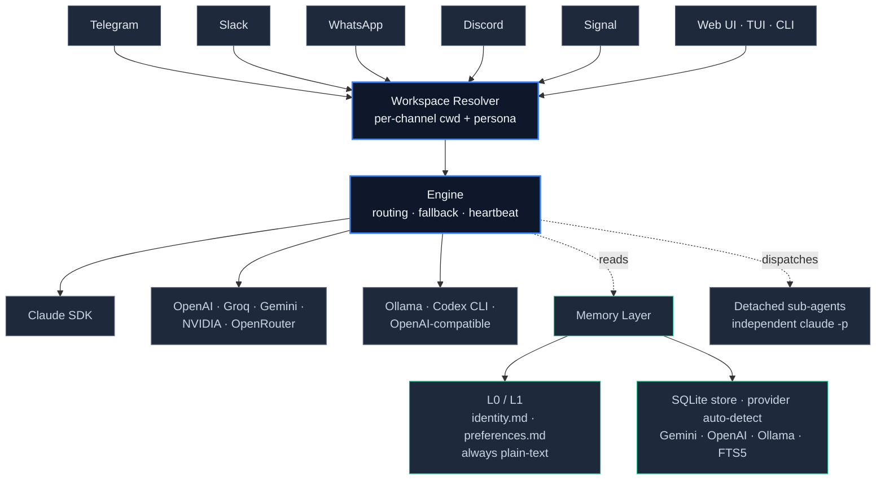

# 🤖 Alvin Bot — Autonomous AI Agent

> Your personal AI agent — on Telegram, WhatsApp, Discord, Slack, Signal, Terminal, and Web.

Open-source, self-hosted, multi-model. Lives where you chat, has full shell + filesystem access, remembers across sessions, and dispatches detached sub-agents for long-running work. Built on the Claude Agent SDK with a provider-agnostic engine that also drives OpenAI, Groq, Gemini, NVIDIA NIM, OpenRouter, and Ollama.

> **What's new — v4.22 (May 2026):** Pluggable memory backends — Gemini · OpenAI · Ollama · **FTS5 keyword fallback (zero-config)**. Users without an embedding API key now get a working indexed memory store out of the box. Smart inject mode trims ~25 k tokens per turn off long system prompts. [Full changelog →](CHANGELOG.md)

---

## ✨ Features

### 🧠 Intelligence
- **Multi-model engine** — Claude Agent SDK · OpenAI · Groq · NVIDIA NIM · Gemini · OpenRouter · Ollama · Codex CLI · any OpenAI-compatible API
- **Automatic fallback + heartbeat monitor** — pings providers every 5 min, auto-failover after 2 failures, auto-recovery; reorder priority via Telegram `/fallback`, Web UI, or API
- **Adjustable thinking depth** — `/effort low` to `/effort max`
- **Pluggable memory backends (v4.22)** — Gemini · OpenAI · Ollama · FTS5 keyword fallback. Auto-detection picks the best available. Indexed search across `MEMORY.md`, daily logs, project files, hub memory, asset index. Override via `EMBEDDINGS_PROVIDER`.
- **Smart system-prompt injection (v4.22)** — once SQLite is populated, stops bulk-injecting `MEMORY.md` and surfaces only the chunks relevant to the user's current message. Cuts ~25 k tokens per turn for typical setups. `MEMORY_INJECT_MODE=auto|legacy|sqlite` to override.
- **Layered memory (L0–L3)** — `identity.md` + `preferences.md` always plain-text · project memories on topic match · daily logs / curated knowledge via semantic or keyword search
- **Persistent sessions** — Claude SDK resume tokens, conversation history, language, effort survive bot restarts
- **Multi-session workspaces** — parallel context-isolated sessions per Slack channel or `/workspace` switch, each with its own cwd, purpose, persona. Memory + skills stay globally shared. [How-to ↓](#-multi-session-workspaces-v4120)
- **Detached sub-agents** — `alvin_dispatch_agent` MCP tool spawns independent `claude -p` subprocesses that survive parent aborts. Results deliver as separate messages. Works identically on Telegram / Slack / Discord / WhatsApp.
- **Smart tool discovery** — scans your system at startup; typical install surfaces 30–70 tools depending on what's locally available
- **Skill system** — 14 SKILL.md files (see [Skills ↓](#-skills)) auto-activate based on message context
- **Self-awareness + auto-language** — knows it IS the AI · detects EN/DE/ES/FR and adapts; learns preference over time

### 💬 Multi-Platform
- **Telegram** — streaming, inline keyboards, voice, photos, documents
- **Slack** — Socket Mode via `@slack/bolt`, DMs + @mentions, file attachments, `assistant.threads.setStatus` typing. **One channel = one isolated workspace.**
- **WhatsApp** — via WhatsApp Web; self-chat as AI notepad, group whitelist with per-contact access, full media. Owner approval gate routes to Telegram (DM / Discord / Signal fallback) before the bot replies.
- **Discord** — server bot with mention/reply detection and slash commands
- **Signal** — via signal-cli REST API, voice transcription
- **Terminal** — rich TUI with ANSI colors + streaming (`alvin-bot tui`)
- **Web UI** — full dashboard, chat, settings, file manager, terminal, workspace overview

### 🔧 Capabilities
- **Tool layer** — Shell · files · Python · git · email · PDF · media · vision · screenshots · system control. Universal tool use across any provider that supports function calling; text-only fallback for those that don't.
- **6 built-in plugins** — weather · finance · notes · calendar · email · smarthome
- **MCP client** — connect any Model Context Protocol server
- **Cron** — AI-driven scheduled tasks (`"check my email every morning"`)
- **Voice** — STT via Groq Whisper, TTS via Edge TTS or ElevenLabs
- **Vision + image generation** — photo / document analysis · Gemini / DALL·E generation with API key
- **Browser** — 4-tier strategy: WebFetch · stealth Playwright · CDP with persistent profile · agent-browser CLI (Tier-1.5, opt-in)

### 🖥️ Web Dashboard
- WebSocket streaming chat · model switcher · platform & provider setup · file manager · memory editor · session browser · in-browser terminal · maintenance + health · workspace cards with cost aggregation

---

## 🚀 Quick Start

```bash
npm install -g alvin-bot
alvin-bot setup
alvin-bot start
```

That's it. The setup wizard validates everything:
- ✅ Tests your AI provider key
- ✅ Verifies your Telegram bot token
- ✅ Confirms the setup works before you start

**Requires:** Node.js 18+ ([nodejs.org](https://nodejs.org)) · Telegram bot token ([@BotFather](https://t.me/BotFather)) · Your Telegram user ID ([@userinfobot](https://t.me/userinfobot))

Free AI providers available — no credit card needed. **Privacy-first?** Pick the 🔒 **Offline — Gemma 4 E4B** option in setup for a fully local LLM via Ollama (macOS/Linux: automated install; Windows: manual).

### 📘 First-time setup walkthroughs

Step-by-step printable PDF guides:

| Platform | PDF (printable) |
|---|---|
| 🍎 **macOS** (with `launchd` background service) | [Download PDF](https://github.com/alvbln/Alvin-Bot/releases/latest/download/Alvin-Bot-macOS-Setup-Guide.pdf) |
| 🪟 **Windows** (with Task Scheduler / Startup folder) | [Download PDF](https://github.com/alvbln/Alvin-Bot/releases/latest/download/Alvin-Bot-Windows-Setup-Guide.pdf) |

Both guides cover: Node.js install · Telegram bot creation · first-time `setup` · foreground test · background service · offline Gemma 4 mode · troubleshooting. ~15 min end-to-end for a first-time user.

### macOS: use `launchd` instead of pm2 (recommended)

If you're on macOS and using Claude Code (Max subscription) as your provider, run the bot as a **LaunchAgent** — it inherits the GUI login session so the macOS Keychain stays unlocked and the Claude OAuth token just works without any manual `security unlock-keychain` dance:

```bash
alvin-bot launchd install    # writes ~/Library/LaunchAgents/com.alvinbot.app.plist and starts the agent
alvin-bot launchd status     # show PID + recent stdout/stderr logs
alvin-bot launchd uninstall  # unload + remove the plist
```

Pm2 still works and remains the default on Linux/Windows — but on macOS with Claude Code, `launchd` is the only path that reliably keeps Keychain access over restarts.

### 📖 Handbook

For a full walkthrough of everything Alvin Bot can do — providers, sub-agents, cron jobs, plugins, MCP, security audit, web UI — read **[`docs/HANDBOOK.md`](docs/HANDBOOK.md)**.

### AI Providers

| Provider | Cost | Best for |
|----------|------|----------|
| **Groq** | Free | Getting started fast |
| **Google Gemini** | Free | Image understanding, embeddings |
| **NVIDIA NIM** | Free | Tool use, 150+ models |
| OpenAI | Paid | GPT-4o quality |
| OpenRouter | Paid | 100+ models marketplace |
| Claude SDK | Paid* | Full agent with tool use |

\*Claude SDK requires a [Claude Max](https://claude.ai) subscription ($20/mo) or Anthropic API access. The setup wizard checks this automatically.

### Alternative Installation

<details>
<summary>One-line install script (Linux/macOS)</summary>

```bash
curl -fsSL https://raw.githubusercontent.com/alvbln/Alvin-Bot/main/install.sh | bash
```

Downloads, builds, and runs the setup wizard automatically.
</details>

<details>
<summary>Desktop App (macOS)</summary>

| Platform | Download | Architecture |
|----------|----------|-------------|
| macOS | [DMG](https://github.com/alvbln/Alvin-Bot/releases/latest) | Apple Silicon (M1+) |
| Windows | Coming soon | x64 |
| Linux | Coming soon | x64 |

The desktop app auto-starts the bot and provides a system tray icon with quick controls.
</details>

<details>
<summary>Docker</summary>

```bash
git clone https://github.com/alvbln/Alvin-Bot.git
cd Alvin-Bot
cp .env.example .env    # Edit with your tokens
docker compose up -d
```

Note: Claude SDK is not compatible with Docker (requires interactive CLI login).
</details>

<details>
<summary>From Source (contributors)</summary>

```bash
git clone https://github.com/alvbln/Alvin-Bot.git
cd Alvin-Bot
npm install
npm run build
node bin/cli.js setup   # Interactive wizard
npm run dev             # Start in dev mode
```
</details>

<details>
<summary>Production (PM2)</summary>

```bash
npm install -g pm2
pm2 start ecosystem.config.cjs
pm2 save && pm2 startup
```
</details>

### Troubleshooting

```bash
alvin-bot doctor        # Check configuration & validate connections
```

If your AI provider isn't working, run `doctor` — it tests the actual API connection and shows exactly what's wrong.

---

## 📋 Commands

| Command | Description |
|---------|-------------|
| `/help` | Show all commands |
| `/start` | Session status overview |
| `/new` | Fresh conversation (reset context) |
| `/model` | Switch AI model (inline keyboard) |
| `/effort <low\|medium\|high\|max>` | Set thinking depth |
| `/voice` | Toggle voice replies |
| `/imagine <prompt>` | Generate images |
| `/web <query>` | Search the web |
| `/remind <time> <text>` | Set reminders (e.g., `/remind 30m Call mom`) |
| `/cron` | Manage scheduled tasks |
| `/recall <query>` | Search memory |
| `/remember <text>` | Save to memory |
| `/export` | Export conversation |
| `/dir <path>` | Change working directory |
| `/workspaces` | List all configured workspaces (v4.12.0) |
| `/workspace [name]` | Show or switch the active workspace — `/workspace default` resets (v4.12.0) |
| `/status` | Current session & cost info |
| `/setup` | Configure API keys & platforms |
| `/system <prompt>` | Set custom system prompt |
| `/fallback` | View & reorder provider fallback chain |
| `/skills` | List available skills & their triggers |
| `/lang <de\|en\|auto>` | Set or auto-detect response language |
| `/cancel` | Abort running request |
| `/reload` | Hot-reload personality (SOUL.md) |

---

## 🏗️ Architecture



### Provider matrix

| Provider | Tool use | Streaming | Vision | Auth |
|---|---|---|---|---|
| Claude SDK (Agent) | ✅ native (Bash, Read, Write, Web, MCP) | ✅ | ✅ | Claude CLI OAuth |
| OpenAI · Groq · Gemini · NVIDIA NIM · OpenRouter | ✅ universal tool use | ✅ | varies | API key |
| Ollama (local) | ✅ via tool-bridge | ✅ | varies | none |
| Codex CLI | ✅ subprocess | ✅ | — | Codex CLI auth |
| Any OpenAI-compatible | ⚡ auto-detect | ✅ | varies | API key |

> **Universal tool use** — Alvin gives full agent powers to any provider that supports function calling. Shell · files · Python · web work everywhere; providers without tool calls degrade cleanly to text-only chat.

### Project layout

```
src/
├── index.ts                 entry point
├── engine.ts                multi-model query engine
├── handlers/                message + command handlers
├── platforms/               Telegram · Slack · WhatsApp · Discord · Signal
├── providers/               Claude SDK · OpenAI-compat · Ollama · Codex CLI
├── services/
│   ├── embeddings/          v4.22 pluggable provider facade (Gemini/OpenAI/Ollama/FTS5)
│   ├── memory*.ts           layered memory (L0-L3) + inject-mode resolver
│   ├── workspaces.ts        per-channel cwd + persona registry
│   ├── alvin-dispatch.ts    detached sub-agent orchestration
│   ├── browser-manager.ts   4-tier browser strategy
│   └── …                    cron · voice · skills · MCP · hooks · …
├── tui/                     terminal chat UI
└── web/                     dashboard server + APIs
web/public/                  zero-build HTML/CSS/JS UI
plugins/                     6 built-in plugins (hot-reload)
skills/                      14 SKILL.md files (hot-reload)
bin/cli.js                   CLI entry point
electron/                    Electron wrapper for the .dmg build
```

---

## 🧭 Multi-Session Workspaces (v4.12.0)

**Run multiple parallel Alvin sessions on the same bot — one per project, context-isolated, memory shared.** Think Claude Coworker, but on your own machine with your own tools. Each workspace has its own working directory, purpose, and optional persona. Sub-agents spawned in one workspace stay in that workspace. Memory, skills, and the knowledge base are globally shared across all of them.

### Why you'd want this

Without workspaces, Alvin has one big blob of context. If you ask about one project's deployment right after debugging a completely unrelated service, Claude pollutes one context with the other. Workspaces solve this: **Slack channel = session**, or on Telegram, **`/workspace my-project` = session**. Each one has its own Claude SDK `resume` token, history, and current project CLAUDE.md loaded via its working directory.

### How it works

1. **Drop a markdown file** into `~/.alvin-bot/workspaces/<name>.md` with YAML frontmatter.
2. **Alvin hot-reloads** the workspace registry (no restart needed — same pattern as skills).
3. On **Slack**, workspaces resolve by explicit channel ID first, then by channel name match (`#my-project` → `workspaces/my-project.md`, case-insensitive).
4. On **Telegram**, run `/workspace <name>` to switch — next message uses the new persona and cwd.
5. Nothing configured? Alvin falls back to the "default" workspace exactly like pre-v4.12 — **no breaking changes**.

### Example workspace file

Create `~/.alvin-bot/workspaces/my-project.md`:

```markdown
---
purpose: my-project website dev
cwd: ~/Projects/my-project
emoji: "🏢"
color: "#6366f1"
channels: ["C01ABCDEF"]
---
You are focused on the my-project website. Stack: React + Express +
Drizzle + MySQL. Production VPS at your-vps.example.com, deploy via rsync.
Prefer concise, directly actionable answers about features, deployment,
and Stripe integration.
```

The `cwd` auto-loads the project-specific `CLAUDE.md` via Claude SDK's `settingSources: ["user", "project"]`, so each workspace inherits its project's conventions automatically. `channels` is optional — omit it to match by filename.

### Slack setup (5 minutes)

1. Download the setup guide + manifest from the [latest release](https://github.com/alvbln/Alvin-Bot/releases/latest):
   - `slack-setup.md` — step-by-step instructions
   - `slack-manifest.json` — copy-paste ready Slack App manifest
2. Create a Slack App from the manifest at https://api.slack.com/apps → **Create New App** → **From an app manifest**
3. Enable Socket Mode, generate an **App-Level Token** (starts with `xapp-`)
4. Install the app to your workspace, copy the **Bot User OAuth Token** (starts with `xoxb-`)
5. Add both to `~/.alvin-bot/.env`:
   ```bash
   SLACK_APP_TOKEN=xapp-1-...
   SLACK_BOT_TOKEN=xoxb-...
   SLACK_ALLOWED_USERS=U01ABCDEF      # optional, comma-separated
   ```
6. Restart Alvin. You should see `💬 Slack connected (Alvin @ YourWorkspace)` in the log.
7. Invite Alvin to channels with `/invite @Alvin`. DMs work without an invite.

### Telegram `/workspace` commands

| Command | Effect |
|---|---|
| `/workspaces` | List all configured workspaces with emojis and purposes (active one marked ✅) |
| `/workspace` | Show the currently active workspace |
| `/workspace <name>` | Switch to `<name>` — next message uses its persona and cwd |
| `/workspace default` | Reset to the default workspace (global cwd, no persona) |

Workspace selection is per Telegram user, persisted across bot restarts via `~/.alvin-bot/state/sessions.json` (v2 envelope format, backwards compatible with v4.11).

### Web UI

The dashboard has a dedicated **🧭 Workspaces** tab (Data section in the sidebar). Each workspace shows as a color-coded card with emoji, purpose, cwd, mapped channels, session count, message count, and cumulative cost. Useful for spotting which project is burning the most tokens.

Or query directly:

```bash
curl -s http://localhost:3100/api/workspaces | jq
```

### Architecture guarantees

- **Memory is global.** Facts Alvin learns in one workspace are visible in every other workspace via the shared `MEMORY.md` and embeddings index. Per-workspace memory layer is on the v4.13 roadmap.
- **Sub-agents are per-session.** Each workspace can dispatch its own detached sub-agents via `alvin_dispatch_agent` — results come back to the originating channel on any platform (Telegram, Slack, Discord, WhatsApp), visible in `/subagents list` (v4.13.0+ dispatch, v4.14.0 cross-platform, v4.14.1 unified list view).
- **Session state survives restart.** Claude SDK `resume` tokens, conversation history, language, effort, and `workspaceName` all persist via `session-persistence.ts` (v4.11.0).
- **Backwards compatible.** If you don't create any workspace files, everything behaves exactly like v4.11. Upgrade is a no-op.

---

## ⚙️ Configuration

### Environment Variables

```env
# Required
BOT_TOKEN=<Telegram Bot Token>
ALLOWED_USERS=<comma-separated Telegram user IDs>

# AI Providers (at least one needed)
# Claude SDK uses CLI auth — no key needed
GROQ_API_KEY=<key>              # Groq (voice + fast models)
NVIDIA_API_KEY=<key>            # NVIDIA NIM models
GOOGLE_API_KEY=<key>            # Gemini + image generation
OPENAI_API_KEY=<key>            # OpenAI models
OPENROUTER_API_KEY=<key>        # OpenRouter (100+ models)

# Provider Selection
PRIMARY_PROVIDER=claude-sdk     # Primary AI provider
FALLBACK_PROVIDERS=nvidia-kimi-k2.5,nvidia-llama-3.3-70b

# Memory backend (v4.22+) — auto-detects based on what keys you have.
# Set to override the default priority: gemini → openai → ollama → fts5.
# fts5 is the zero-config keyword fallback — no key needed, works for everyone.
EMBEDDINGS_PROVIDER=auto                  # auto | gemini | openai | ollama | fts5
OLLAMA_EMBEDDING_MODEL=nomic-embed-text   # only used for ollama provider
MEMORY_INJECT_MODE=auto                   # auto | legacy | sqlite (see CHANGELOG v4.22)

# Optional Platforms
WHATSAPP_ENABLED=true           # Enable WhatsApp (needs Chrome)
DISCORD_TOKEN=<token>           # Enable Discord
SIGNAL_API_URL=<url>            # Signal REST API URL
SIGNAL_NUMBER=<number>          # Signal phone number
SLACK_BOT_TOKEN=xoxb-...        # Slack Bot User OAuth Token (Socket Mode)
SLACK_APP_TOKEN=xapp-1-...      # Slack App-Level Token (connections:write scope)
SLACK_ALLOWED_USERS=U01...      # Optional: comma-separated Slack user IDs allowlist

# Multi-Session (v4.12.0)
SESSION_MODE=per-channel        # per-user (default) | per-channel | per-channel-peer
                                # per-channel gives each Slack channel / group its own isolated session

# Optional
WORKING_DIR=~                   # Default working directory (used when no workspace is resolved)
MAX_BUDGET_USD=5.0              # Cost limit per session
WEB_PORT=3100                   # Web UI port
WEB_PASSWORD=<password>         # Web UI auth (optional)
CHROME_PATH=/path/to/chrome     # Custom Chrome path (for WhatsApp)
MEMORY_EXTRACTION_DISABLED=1    # Opt out of v4.11.0 auto-fact-extraction in compaction
```

### Custom Models

Add any OpenAI-compatible model via `docs/custom-models.json`:

```json
[
  {
    "key": "my-local-llama",
    "name": "Local Llama 3",
    "model": "llama-3",
    "baseUrl": "http://localhost:11434/v1",
    "apiKeyEnv": "OLLAMA_API_KEY",
    "supportsVision": false,
    "supportsStreaming": true
  }
]
```

### Personality

Edit `SOUL.md` to customize the bot's personality. Changes apply on `/reload` or bot restart.

### WhatsApp Setup

WhatsApp uses [whatsapp-web.js](https://github.com/nicholascui/whatsapp-web.js) — the bot runs as **your own WhatsApp account** (not a separate business account). Chrome/Chromium is required.

**1. Enable WhatsApp**

Set `WHATSAPP_ENABLED=true` in `.env` (or toggle via Web UI → Platforms → WhatsApp). Restart the bot.

**2. Scan QR Code**

On first start, a QR code appears in the terminal (and in the Web UI). Scan it with WhatsApp on your phone (Settings → Linked Devices → Link a Device). The session persists across restarts.

**3. Chat Modes**

| Mode | Env Variable | Description |
|------|-------------|-------------|
| **Self-Chat** | *(always on)* | Send yourself messages → bot responds. Your AI notepad. |
| **Groups** | `WHATSAPP_ALLOW_GROUPS=true` | Bot responds in whitelisted groups. |
| **DMs** | `WHATSAPP_ALLOW_DMS=true` | Bot responds to private messages from others. |
| **Self-Chat Only** | `WHATSAPP_SELF_CHAT_ONLY=true` | Disables groups and DMs — only self-chat works. |

All toggles are also available in the Web UI (Platforms → WhatsApp). Changes apply instantly — no restart needed.

**4. Group Whitelist**

Groups must be explicitly enabled. In the Web UI → Platforms → WhatsApp → Group Management:

- **Enable** a group to let the bot listen
- **Allowed Contacts** — Select who can trigger the bot (empty = everyone)
- **@ Mention Required** — Bot only responds when mentioned (voice/media bypass this)
- **Process Media** — Allow photos, documents, audio, video
- **Approval Required** — Owner must approve each message via Telegram before the bot responds. Group members see nothing — completely transparent.

> **Note:** Your own messages in groups are never processed (you ARE the bot on WhatsApp). The bot only responds to other participants. In self-chat, your messages are always processed normally.

**5. Approval Flow** (when enabled per group)

1. Someone writes in a whitelisted group
2. You get a Telegram notification with the message preview + ✅ Approve / ❌ Deny buttons
3. Approve → bot processes and responds in WhatsApp. Deny → silently dropped.
4. Fallback channels if Telegram is unavailable: WhatsApp self-chat → Discord → Signal
5. Unapproved messages expire after 30 minutes.

---

## 🔌 Plugins

Built-in plugins in `plugins/`:

| Plugin | Description |
|--------|-------------|
| weather | Current weather & forecasts |
| finance | Stock prices & crypto |
| notes | Personal note-taking |
| calendar | Calendar integration |
| email | Email management |
| smarthome | Smart home control |

Plugins are auto-loaded at startup. Create your own by adding a directory with an `index.js` exporting a `PluginDefinition`.

---

## 🎯 Skills

Skills are markdown files in `skills/` that auto-activate when the user's message matches their trigger keywords. The skill body gets injected into the system prompt, giving the agent specialized expertise on demand. 14 ship built-in:

| Skill | Description |
|---|---|
| **agent-browser** | Token-efficient web automation via the agent-browser CLI (accessibility-tree snapshots) — Tier 1.5 of the browser stack |
| **apple-notes** | Read, create, search Apple Notes via AppleScript (macOS) |
| **browse** | 3-tier browser control: WebFetch · stealth Playwright · CDP with persistent profile |
| **code-project** | Software development workflows: build, debug, refactor, architecture patterns |
| **data-analysis** | CSV / JSON / Excel processing, charts, statistics via Python |
| **document-creation** | Professional PDFs, reports, letters with formatting |
| **email-summary** | Inbox triage, newsletter digests, priority sorting |
| **github** | Issues, PRs, releases, workflows via the `gh` CLI |
| **social-fetch** | Analyse Instagram / TikTok / YouTube / X URLs the user shares |
| **summarize** | Condense URLs, PDFs, long documents |
| **system-admin** | Server management, deploys, Docker, nginx, SSL |
| **weather** | Forecasts and conditions |
| **web-research** | Deep multi-source research with citation aggregation |
| **webcheck** | Security / SEO audit of a website |

Drop your own `<name>/SKILL.md` into `~/.alvin-bot/skills/` for hot-reload. List active skills via `/skills` or `alvin-bot skills`.

---

## 🛠️ CLI

```bash
alvin-bot setup     # Interactive setup wizard
alvin-bot tui       # Terminal chat UI ✨
alvin-bot chat      # Alias for tui
alvin-bot doctor    # Health check
alvin-bot update    # Pull latest & rebuild
alvin-bot start     # Start the bot (background via pm2)
alvin-bot start -f  # Start in foreground
alvin-bot stop      # Stop the bot
alvin-bot launchd install    # macOS only: install as LaunchAgent
alvin-bot launchd status     # macOS only: show LaunchAgent state
alvin-bot launchd uninstall  # macOS only: remove LaunchAgent
alvin-bot audit     # Security health check
alvin-bot search    # Search assets/memories/skills
alvin-bot version   # Show version
```

---

## 🗺️ Roadmap

> Per-version details: see [`CHANGELOG.md`](CHANGELOG.md). The roadmap is a forward-looking summary, not a changelog.

### ✅ Recently shipped

| Version | Theme | Highlights |
|---|---|---|
| **v4.22** *(May 2026)* | Memory architecture overhaul | Pluggable embedding providers — **Gemini · OpenAI · Ollama · FTS5 (zero-config keyword fallback)**. Auto-detection picks the best available, so users with no API key still get a working indexed memory store. Smart inject mode stops bulk-injecting `MEMORY.md` once SQLite is populated. |
| **v4.21** | Agent Browser skill | Tier-1.5 token-efficient web automation via the [agent-browser](https://github.com/vercel-labs/agent-browser) CLI — opt-in by install. ~90 % token reduction vs Playwright on cooperative pages. |
| **v4.20** | SQLite-backed vector memory | Replaces the legacy 128 MB JSON index. Automatic migration on first start, per-chunk INSERT/UPDATE, lazy native binary load with graceful fallback. |
| **v4.18 – v4.19** | Reliability + per-workspace overrides | SDK auto-recovery on token rotation / quota exhaustion / empty streams. Per-workspace `effort` / `provider` / `voice` / `temperature` / `toolset`. |
| **v4.17** | Hardening audit | Disk cleanup service, hardening fixes from internal audit. |
| **v4.13 – v4.14** | Detached sub-agents | `alvin_dispatch_agent` MCP tool spawns independent `claude -p` subprocesses that survive parent aborts. Multi-platform dispatch (Slack / Discord / WhatsApp). Watcher zombie guard. |
| **v4.10 – v4.12** | Multi-session + Slack | Workspace registry with hot-reload, per-channel personas + cwd, Slack adapter with progress ticker + typing status, owner approval gate, async sub-agents. |

### 🏛️ Foundations (built before v4.10)

Multi-model provider abstraction with fallback chains · plugin & skill ecosystems with hot-reload · multi-platform adapters (Telegram, WhatsApp, Discord, Signal, Slack) · Web UI with i18n + command palette · native macOS `.dmg` via Electron · Docker Compose · npm distribution · MCP client + custom tools · universal tool use across providers · full media pipeline (audio · video · photo · voice).

### 🎯 On the radar

| Priority | Item | Why |
|---|---|---|
| **P0 → v5.0** | MCP plugin sandboxing | MCP servers currently run with full Node privileges. Plan: child process with restricted FS + network policy (deno-permission style). Architectural change. |
| **P1** | Electron major upgrade (35 → 41+) + Windows `.exe` | Closes desktop-build CVEs, unblocks the only platform still missing a native installer. |
| **P1** | Prompt injection defense policy | Needs a design decision (heuristic filter / allow-list / accept-the-risk with clearer warnings) and consistent enforcement at every message entry point. |
| **P2** | Per-workspace memory layer | Facts learned in one workspace stay scoped unless explicitly promoted. Builds on the v4.22 SQLite store. |
| **P2** | Per-workspace skill allowlist | Scope Apple Notes to personal workspace, sysadmin tools to devops only, etc. |
| **P2** | Multi-user Slack (`per-channel-peer`) | Different users in the same Slack channel get their own sub-sessions. |
| **P3** | Linux `.AppImage` / `.deb`, Homebrew formula, Scoop manifest, one-line install script | Platform reach for non-npm users. |
| **P3** | Daily-log decay / archive | Older daily logs move to cold storage after N days. |
| **P3** | Workspace cloning / templates | `/workspace clone my-project as my-fork` spins up a new workspace from an existing one. |
| **P3** | TypeScript 5 → 6 | 5.x still supported; strict-mode break-fix work, not urgent. |

Pull requests welcome — see [`CONTRIBUTING.md`](CONTRIBUTING.md).

---

## 🔒 Security

> ### ⚠️ Important: Alvin has full shell + filesystem access
>
> Alvin Bot is an **autonomous AI agent** built on the Claude Agent SDK with shell, filesystem, and network access to the machine it runs on. This is by design — it's the point of the project. But it means:
>
> - **Treat the bot like `sudo` access** — only install it on machines where you'd trust Claude Code to run without supervision.
> - **Never expose the Web UI (port 3100) to the internet** without HTTPS, rate limiting, and a strong `WEB_PASSWORD`. It binds to `localhost` by default.
> - **On multi-user systems**, verify `~/.alvin-bot/.env` is chmod `600` (v4.12.2+ enforces this automatically on startup).
> - **`ALLOWED_USERS` is your first line of defense** — v4.12.2+ refuses to start if it's empty and Telegram is enabled.
>
> **Read the full threat model and hardening guide:** [`docs/security.md`](docs/security.md)

### Access control

- **User whitelist** — Only `ALLOWED_USERS` can interact with the bot (hard-enforced at startup since v4.12.2)
- **WhatsApp group approval** — Per-group participant whitelist + owner approval gate via Telegram (with WhatsApp DM / Discord / Signal fallback). Group members never see the approval process.
- **Slack allowlist** — `SLACK_ALLOWED_USERS` restricts who can DM or @mention the bot in Slack
- **DM pairing** — Optional 6-digit code flow for new users via owner approval (`AUTH_MODE=pairing`)

### Execution hardening

- **`EXEC_SECURITY=allowlist`** (default) — Shell commands must match a whitelist of safe binaries and **cannot contain shell metacharacters** (`;`, `|`, `&`, `` ` ``, `$(...)`, redirects). Rejected by v4.12.2's exec-guard metachar filter.
- **Cron shell jobs** go through the same exec-guard (v4.12.2+) — cron is no longer a bypass vector.
- **Sub-agent toolset presets** — spawn sub-agents with `toolset: "readonly"` or `"research"` to restrict what they can do, regardless of the parent's privileges.
- **Timing-safe webhook auth** — `POST /api/webhook` uses `crypto.timingSafeEqual` (v4.12.2+) to prevent timing side-channel token extraction.

### Data hardening

- **Self-hosted** — Your data stays on your machine. No cloud sync, no external logging of prompts or responses.
- **No telemetry** — Zero tracking, zero analytics, zero phone-home.
- **File permissions** — `.env`, `sessions.json`, memory logs, cron jobs, and all sensitive state files are chmod `0o600` on every write and repaired at startup (v4.12.2+).
- **Owner protection** — Owner account cannot be deleted via UI.
- **Encrypted sudo credentials** — If you enable sudo exec, passwords are stored encrypted with an XOR key in a separate file, both chmod `0o600`.

### Known limitations (documented honestly)

- **Prompt injection** cannot be reliably filtered — we document this as a capability tradeoff rather than pretending to solve it. See `docs/security.md` for the full discussion.
- **Not yet hardened for public-internet deployment** — current scope is "on your own machine". VPS deployment works but requires additional reverse-proxy + TLS + rate-limit setup that we don't automate.
- **Electron Desktop build** has known CVEs (Phase 18 roadmap). The primary distribution is npm global install, not Desktop — if you don't use the Desktop wrapper, you're not affected.

---

## 📄 License

MIT — See [LICENSE](LICENSE).

---

## 🤝 Contributing

Issues and PRs welcome! Please read the existing code style before contributing.

```bash
git clone https://github.com/alvbln/Alvin-Bot.git
cd alvin-bot
npm install
npm run dev    # Development with hot reload
```
