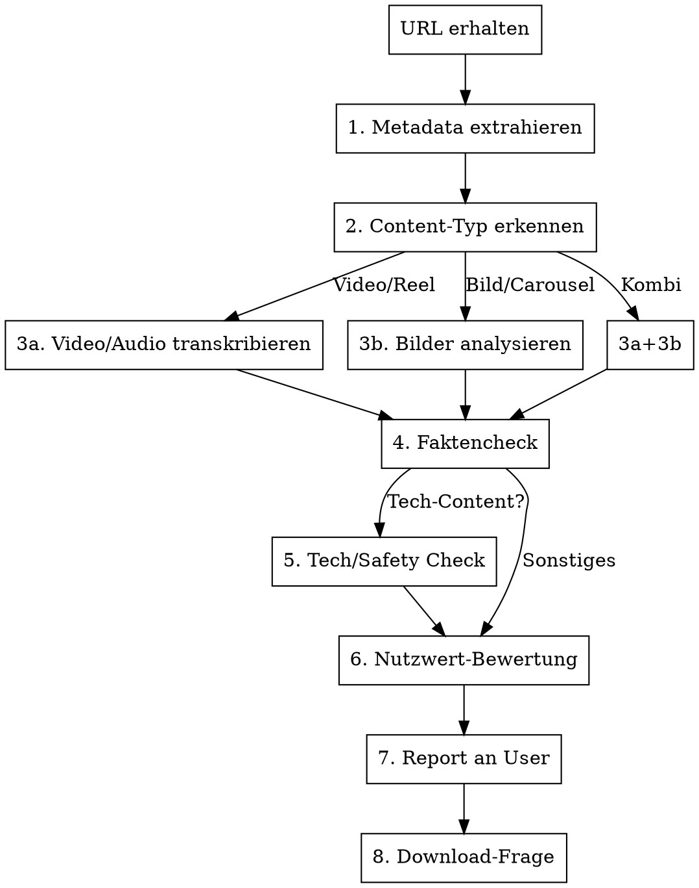

# Social Media Fetch & Intelligence

Analysiert Social-Media-Content ganzheitlich: Download, Transkription, Bildanalyse, Faktencheck, Safety-Check, Nutzwert-Bewertung.

## URL-Erkennung

Trigger bei URLs von:
- **Instagram:** `instagram.com/p/`, `instagram.com/reel/`, `instagram.com/stories/`
- **TikTok:** `tiktok.com/@`, `vm.tiktok.com/`
- **YouTube:** `youtube.com/watch`, `youtu.be/`, `youtube.com/shorts/`
- **Twitter/X:** `twitter.com/`, `x.com/`

## Workflow



## Phase 1: Metadata extrahieren

```bash
# Universell via yt-dlp (funktioniert fuer YT, TikTok, IG, Twitter)
yt-dlp --dump-json --no-download "<URL>" > /tmp/social-meta.json

# Relevante Felder extrahieren
python3 -c "
import json
d = json.load(open('/tmp/social-meta.json'))
print(f'Title:       {d.get(\"title\", \"?\")}'  )
print(f'Uploader:    {d.get(\"uploader\", d.get(\"channel\", \"?\"))}'  )
print(f'Platform:    {d.get(\"extractor_key\", \"?\")}'  )
print(f'Duration:    {d.get(\"duration\", 0)}s'  )
print(f'Views:       {d.get(\"view_count\", \"?\")}'  )
print(f'Likes:       {d.get(\"like_count\", \"?\")}'  )
print(f'Upload date: {d.get(\"upload_date\", \"?\")}'  )
print(f'Description: {d.get(\"description\", \"\")[:500]}'  )
print(f'Thumbnails:  {len(d.get(\"thumbnails\", []))}'  )
print(f'Formats:     {len(d.get(\"formats\", []))}'  )
# Detect content type
has_video = d.get('duration', 0) > 0
has_images = 'carousel' in str(d).lower() or d.get('_type') == 'playlist'
print(f'Has video:   {has_video}')
print(f'Has images:  {has_images}')
"
```

**Wenn yt-dlp fehlschlaegt** (private IG Posts etc.):
1. Tier 2 CDP Browser: `alvin-bot browser goto <url>` + `alvin-bot browser shot <url>`
2. Cookies exportieren fuer yt-dlp: `--cookies /tmp/ig-cookies.txt`
3. Oder `instaloader` fuer Instagram: `python3 -m instaloader -- -<shortcode>`

## Phase 2: Content-Typ erkennen

| Signal | Typ | Naechster Schritt |
|--------|-----|-------------------|
| `duration > 0` | Video/Reel/Clip | Transkription + Bildanalyse (Thumbnails/Frames) |
| Carousel/Multi-Image | Bilderkarussell | Alle Bilder analysieren |
| Einzelbild, duration=0 | Statisches Bild | Bildanalyse |
| duration > 0 + Carousel | Kombi | Beides |

## Phase 3a: Video/Audio transkribieren

```bash
# 1. Audio extrahieren
yt-dlp -x --audio-format mp3 -o "/tmp/social-audio.%(ext)s" "<URL>"

# 2. Transkription via Groq Whisper (schnell + kostenlos)
curl -s https://api.groq.com/openai/v1/audio/transcriptions \
  -H "Authorization: Bearer $GROQ_API_KEY" \
  -F "file=@/tmp/social-audio.mp3" \
  -F "model=whisper-large-v3-turbo" \
  -F "response_format=text" > /tmp/social-transcript.txt

# 3. Falls >25MB: Erst komprimieren
ffmpeg -i /tmp/social-audio.mp3 -b:a 64k -ar 16000 /tmp/social-audio-small.mp3
```

**Sprache:** Auto-Detect (kein `language` Parameter). Ergebnis in Originalsprache.

## Phase 3b: Bilder analysieren

```bash
# Thumbnail/Frame als Bild speichern
yt-dlp --write-thumbnail --skip-download -o "/tmp/social-thumb" "<URL>"

# Oder: Keyframes aus Video extrahieren (1 Frame pro 10s)
ffmpeg -i /tmp/social-video.mp4 -vf "fps=1/10" /tmp/social-frame-%03d.jpg
```

**Bildanalyse** via Read-Tool (multimodal):
- Text im Bild lesen (OCR-artig)
- UI-Screenshots interpretieren
- Diagramme/Charts verstehen
- Code-Snippets erkennen
- Personen/Kontext beschreiben

## Phase 4: Faktencheck

### Allgemeiner Faktencheck
Fuer JEDEN Post durchfuehren:

1. **Behauptungen extrahieren** — Was wird konkret behauptet? (Zahlen, Statistiken, Zitate, Fakten)
2. **Quellen pruefen** — WebSearch nach jeder zentralen Behauptung
3. **Bias erkennen** — Wer postet? Welches Interesse? Affiliate-Links? Sponsored?
4. **Aktualitaet** — Stimmen die Infos noch? Veraltet?
5. **Kontext** — Fehlt Kontext der die Aussage relativiert?

### Bewertungsskala

| Emoji | Bewertung | Bedeutung |
|-------|-----------|-----------|
| :check: | Verifiziert | Fakten geprueft und korrekt |
| :warning: | Teilweise | Kern stimmt, aber Nuancen fehlen oder uebertrieben |
| :x: | Falsch/Irrefuehrend | Zentrale Behauptungen widerlegt |
| :question: | Nicht verifizierbar | Keine zuverlaessigen Quellen gefunden |

## Phase 5: Tech/Safety Check (nur bei Tech-Content)

Wenn der Post ein **Tool, Library, GitHub-Repo, SaaS, API** bewirbt:

### Repository finden
```bash
# GitHub-Suche
gh search repos "<tool-name>" --sort=stars --limit=5
# Oder direkt wenn URL im Post
gh repo view <owner/repo> --json name,description,stargazersCount,forkCount,updatedAt,license,openIssues
```

### Safety-Checklist (Repo-Level)

| Check | Command | Red Flag |
|-------|---------|----------|
| Stars/Forks | `gh repo view --json stargazersCount` | <100 Stars bei "populaerem" Tool |
| Letzter Commit | `gh repo view --json updatedAt` | >6 Monate her |
| Lizenz | `gh repo view --json license` | Keine Lizenz / proprietaer |
| Issues | `gh repo view --json openIssues` | Viele offene Security-Issues |
| Dependencies | `gh api repos/{owner}/{repo}/dependency-graph/sbom` | Bekannte CVEs |
| README | Content pruefen | Kein README, kein Docs |
| Maintainer | `gh api users/{owner}` | Neuer Account, keine Historie |
| Funding/Sponsor | Check README/FUNDING.yml | Crypto/Scam-Signale |

### Code Security Audit (PFLICHT bei Tools die man installieren/ausfuehren wuerde)

**Ziel:** Sicherstellen dass kein Schadcode, keine versteckten Backdoors, keine Datenexfiltration.

#### Quick Scan (immer durchfuehren)
```bash
# 1. Repo klonen in temp
REPO_DIR=$(mktemp -d)
git clone --depth=1 <repo-url> "$REPO_DIR"

# 2. Verdaechtige Patterns suchen
grep -rn --include="*.{js,ts,py,sh,go,rs}" \
  -E "(eval\(|exec\(|child_process|subprocess|os\.system|fetch\(|XMLHttpRequest|curl |wget |nc |reverse.shell|bind.shell)" \
  "$REPO_DIR" | head -30

# 3. Hardcoded Secrets/IPs/Domains suchen
grep -rn --include="*.{js,ts,py,json,yml,yaml,toml}" \
  -E "([0-9]{1,3}\.){3}[0-9]{1,3}|https?://[a-z0-9]+([\-\.][a-z0-9]+)*\.[a-z]{2,}" \
  "$REPO_DIR" | grep -v "node_modules\|\.git\|localhost\|127\.0\.0\.1\|example\.com\|github\.com\|npmjs\|pypi" | head -20

# 4. Obfuscated Code erkennen
grep -rn --include="*.{js,ts}" \
  -E "(atob\(|btoa\(|Buffer\.from\(.*base64|\\\\x[0-9a-f]{2}|\\\\u[0-9a-f]{4}|fromCharCode)" \
  "$REPO_DIR" | head -10

# 5. Netzwerk-Calls in unerwarteten Stellen
grep -rn --include="*.{js,ts,py}" \
  -E "(\.send\(|\.post\(|requests\.(get|post)|urllib|aiohttp|axios\.(get|post)|fetch\()" \
  "$REPO_DIR" | grep -v "test\|spec\|__test__\|mock" | head -20

# 6. Aufraumen
rm -rf "$REPO_DIR"
```

#### Deep Scan (bei verdaechtigen Findings oder bei Tools die Systemzugriff brauchen)
```bash
# Package-Manager Checks
# NPM: postinstall Scripts sind ein beliebter Angriffsvektor
cat "$REPO_DIR/package.json" | python3 -c "
import json, sys
pkg = json.load(sys.stdin)
scripts = pkg.get('scripts', {})
for key in ['preinstall', 'postinstall', 'prepare', 'prepublish']:
    if key in scripts:
        print(f'⚠️  {key}: {scripts[key]}')
deps = {**pkg.get('dependencies', {}), **pkg.get('devDependencies', {})}
print(f'Dependencies: {len(deps)}')
"

# Python: setup.py kann beliebigen Code ausfuehren
grep -n "os\.\|subprocess\.\|exec\|eval\|import.*requests" "$REPO_DIR/setup.py" 2>/dev/null

# Docker: Was wird im Container ausgefuehrt?
grep -n "RUN\|CMD\|ENTRYPOINT\|EXPOSE\|ENV" "$REPO_DIR/Dockerfile" 2>/dev/null | head -15

# GitHub Actions: Workflow-Injection?
grep -rn "run:\|uses:" "$REPO_DIR/.github/workflows/" 2>/dev/null | head -20
```

#### Red Flags Matrix

| Severity | Signal | Bedeutung |
|----------|--------|-----------|
| **KRITISCH** | `eval()` mit User-Input / Netzwerk-Daten | Remote Code Execution moeglich |
| **KRITISCH** | Obfuscated Code (base64-encoded Scripts) | Versteckter Payload |
| **KRITISCH** | Outbound HTTP in postinstall | Datenexfiltration bei Installation |
| **KRITISCH** | Hardcoded IPs/Domains (nicht Docs/Tests) | C2 Server / Exfiltration |
| **HOCH** | Uebermässige Permissions (root, sudo, alle Env-Vars) | Privilege Escalation |
| **HOCH** | Liest ~/.ssh, ~/.aws, ~/.config, Keychain | Credential Theft |
| **HOCH** | Schreibt in /etc, /usr, ~/.bashrc, ~/.zshrc | Persistence / Manipulation |
| **MITTEL** | Viele Dependencies mit wenig Stars | Supply Chain Risk |
| **MITTEL** | Minified Source ohne Build-Pipeline | Schwer zu auditieren |
| **NIEDRIG** | Kein SECURITY.md / keine CVE Policy | Unreifes Projekt |

#### Empfehlung formulieren

Nach dem Security-Check IMMER eine klare Empfehlung:

- **SAFE** — Code sauber, bekannte Maintainer, transparente Dependencies
- **CAUTION** — Einige Findings, aber erklaerbar (z.B. eval in Template-Engine). Nur in Sandbox nutzen.
- **AVOID** — Verdaechtige Patterns, nicht vertrauenswuerdig. Nicht installieren.
- **MALWARE** — Eindeutig schaedlicher Code. Nicht anfassen. Ggf. GitHub Report.

### SaaS/Closed-Source Tools
- **Pricing transparent?** Oder Bait-and-Switch?
- **Datenschutz:** Wo werden Daten gespeichert? DSGVO?
- **Alternativen:** Gibt es Open-Source-Alternativen?
- **Track Record:** Wie lange existiert das Unternehmen?
- **Permissions:** Was will die App/Extension fuer Rechte? Proportional zum Nutzen?

## Phase 6: Nutzwert-Bewertung

### Fuer Nutzwert des Users bewerten

| Dimension | Fragen |
|-----------|--------|
| **Relevanz** | Passt es zu IT-Delivery, Consulting, SaaS, DevOps, AI? |
| **Einsatz** | Koennen wir es direkt nutzen? In einem Projekt? Als Content-Inspiration? |
| **ROI** | Lohnt sich der Zeitaufwand? Kostenlos vs. Paid? |
| **Qualitaet** | Ist der Content gut gemacht? Substanz oder Hype? |
| **Sharing** | Lohnt es sich, den Content weiterzuteilen oder darauf zu reagieren? |

### Bewertungs-Rating

- **S-Tier:** Sofort einsetzen / Must-have Tool
- **A-Tier:** Sehr nuetzlich, bei Gelegenheit einbauen
- **B-Tier:** Interessant, merken fuer spaeter
- **C-Tier:** Nett zu wissen, kein Handlungsbedarf
- **F-Tier:** Muell / Scam / Zeitverschwendung

## Phase 7: Report

Dem User IMMER einen strukturierten Report liefern:

```
## [Platform-Emoji] [Titel/Thema]

**Creator:** @username (X Follower, Y Posts)
**Typ:** Video/Reel/Carousel (Xs / N Bilder)
**Datum:** TT.MM.JJJJ

### Inhalt
[Zusammenfassung in 3-5 Saetzen]

### Transkript (Kurzfassung)
[Wichtigste Aussagen, bei Video]

### Faktencheck [Emoji]
- Behauptung 1: [Status + Quelle]
- Behauptung 2: [Status + Quelle]

### Tech-Check (falls zutreffend)
- Repo: [Link] | Stars | Lizenz | Letzter Commit
- Safety: [OK/Warnung/Kritisch]
- Alternativen: [Falls vorhanden]

### Nutzwert [Rating]
[1-2 Saetze warum nuetzlich/nicht]

### Empfehlung
[Konkreter Vorschlag: nutzen/merken/ignorieren]
```

## Phase 8: Download-Frage

**IMMER am Ende fragen:**

> Soll ich die Assets (Video/Bilder) nach `~/Desktop/SocialMedia-Fetch/[ordner-name]/` downloaden?

Erst bei Bestaetigung:

```bash
# Ordner anlegen
FOLDER=~/Desktop/SocialMedia-Fetch/<kurzer-name>
mkdir -p "$FOLDER"

# Video (beste Qualitaet)
yt-dlp -o "$FOLDER/video.%(ext)s" "<URL>"

# Thumbnail
yt-dlp --write-thumbnail --skip-download -o "$FOLDER/thumb" "<URL>"

# Beschreibung + Metadaten
yt-dlp --dump-json --no-download "<URL>" | python3 -c "
import json, sys
d = json.load(sys.stdin)
with open('$FOLDER/info.md', 'w') as f:
    f.write(f'# {d.get(\"title\", \"?\")}\n\n')
    f.write(f'**URL:** {d.get(\"webpage_url\", \"?\")}\n')
    f.write(f'**Creator:** {d.get(\"uploader\", \"?\")}\n')
    f.write(f'**Datum:** {d.get(\"upload_date\", \"?\")}\n')
    f.write(f'**Views:** {d.get(\"view_count\", \"?\")}\n\n')
    f.write(f'## Beschreibung\n\n{d.get(\"description\", \"\")}\n')
"

# Transkript speichern (falls vorhanden)
cp /tmp/social-transcript.txt "$FOLDER/transcript.txt" 2>/dev/null

# Faktencheck-Report
# (wird vom Agent aus Phase 7 Report generiert und als report.md gespeichert)
```

### Ordner-Benennung

Format: `YYYY-MM-DD_platform_kurzname`

Beispiele:
- `2026-04-13_youtube_cursor-ai-review`
- `2026-04-13_instagram_devops-metrics-carousel`
- `2026-04-13_tiktok_claude-code-hack`

Max 50 Zeichen, lowercase, Bindestriche, keine Sonderzeichen.

## Eskalation bei Problemen

| Problem | Loesung |
|---------|---------|
| yt-dlp 403/Login required | Tier 2 CDP Cookies exportieren |
| Instagram private Post | `instaloader --login=<user>` oder CDP |
| TikTok Geo-Block | VPN-Hinweis an User |
| Video >25MB fuer Whisper | ffmpeg Kompression auf 64kbps |
| Kein Audio (Slideshow) | Nur Bildanalyse, Captions lesen |
| Rate Limited | Pause + Retry mit Backoff |

## Erweiterungen (nach Ermessen)

- **Hashtag-Analyse:** Welche Hashtags? Trending? Nische?
- **Engagement-Metriken:** Like/View Ratio als Qualitaetssignal
- **Creator-Profil:** Schneller Check wer der Creator ist (Expertise, Follower, Posting-Frequenz)
- **Vergleichbare Posts:** Gibt es bessere/ausfuehrlichere Quellen zum gleichen Thema?
- **Content-Inspiration:** Falls thematisch passend — als Inspiration vormerken?
